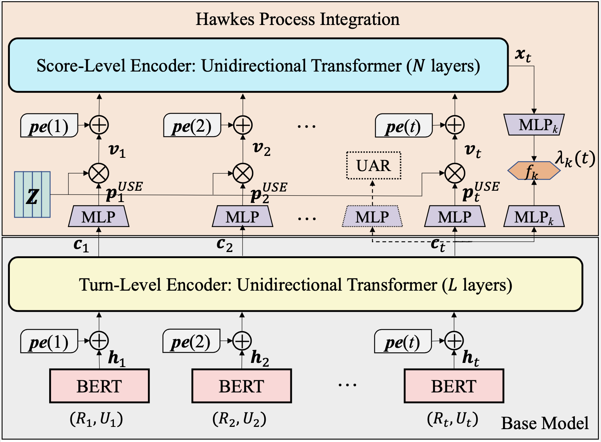

# ASAP-User Satisfaction Estimation
This is the Pytorch implementation of our work: **Modeling User Satisfaction Dynamics in Dialogue via Hawkes Process. Fanghua Ye, Zhiyuan Hu, Emine Yilmaz. ACL 2023.** [[paper](https://arxiv.org/abs/2305.12594)]

## Abstract
Dialogue systems have received increasing attention while automatically evaluating their performance remains challenging. User satisfaction estimation (USE) has been proposed as an alternative. It assumes that the performance of a dialogue system can be measured by user satisfaction and uses an estimator to simulate users. The effectiveness of USE depends heavily on the estimator. Existing estimators independently predict user satisfaction at each turn and ignore satisfaction dynamics across turns within a dialogue. In order to fully simulate users, it is crucial to take satisfaction dynamics into account. To fill this gap, we propose a new estimator ASAP (s**A**tisfaction e**S**timation via H**A**wkes **P**rocess) that treats user satisfaction across turns as an event sequence and employs a Hawkes process to effectively model the dynamics in this sequence. Experimental results on four benchmark dialogue datasets demonstrate that ASAP can substantially outperform state-of-the-art baseline estimators.

## Model Architecture
The proposed ASAP model consists of a base estimator module and a Hawkes process integration module. Both modules leverage positional
encodings to retain temporal information. The base estimator leverages only the dialogue context for satisfaction estimation, while the Hawkes process integration module captures the dynamics of user satisfaction across turns within a dialogue.

<p align="center">
  
</p>

<p align="center">The model architecture of ASAP</p>

## Training
The datasets we have experimented with include MWOZ, SGD, ReDial and JDDC (Chinese).

For training on the English datasets, run the following script:
```console
❱❱❱ bash train.sh
```

For training on JDDC, use the following script:
```console
❱❱❱ bash train-JDDC.sh
```

Our trained model checkpoints on all datasets can be downloaded [here](https://drive.google.com/drive/folders/1YXUB2GVazUM_iW2k4oz6KlaCOc8cRg37?usp=share_link).


## Citation

```bibtex
@inproceedings{ye2023modeling,
  title={Modeling User Satisfaction Dynamics in Dialogue via Hawkes Process},
  author={Ye Fanghua, Hu Zhiyuan, Yilmaz Emine},
  booktitle={The 61st Annual Meeting of the Association for Computational Linguistics (ACL’23)},
  year={2023}
  }
```

## Reference
Our implementation is based on [USDA](https://github.com/dengyang17/USDA). We also leveraged the datasets preprocessed by USDA directly.
